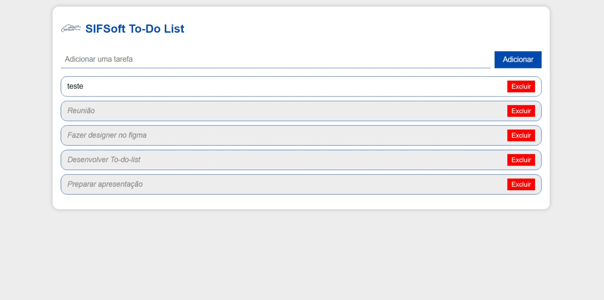

# SIFSoft To-Do List

## Descrição

O SIFSoft To-Do List é uma aplicação simples de lista de tarefas que permite aos usuários adicionar, gerenciar e marcar tarefas como concluídas. É uma ferramenta útil para ajudar a organizar seu trabalho e manter o controle de suas tarefas diárias.

## Uso

- Digite uma tarefa na caixa de entrada.
- Clique no botão "Adicionar" para adicionar a tarefa à lista.
- Para marcar uma tarefa como concluída, clique nela.
- Para excluir uma tarefa, clique no botão "Excluir" ao lado dela.

## Instalação e Requisitos

Não é necessário instalação. Basta abrir o arquivo `index.html` em um navegador da web.
Pode Tambem ser acessado por esse link https://65294fce4b271a44ea634f66--courageous-crumble-5a8fa2.netlify.app/

Contribuição
Contribuições são bem-vindas! Por favor, siga as diretrizes de contribuição.

Licença
Este projeto está licenciado sob a Licença MIT. Consulte o arquivo LICENSE para obter detalhes.

Contato
Se você tiver alguma dúvida ou precisar de ajuda, entre em contato conosco em stephendias@hotmail.com.br.

## Introdução:
- Apresentação: Este é um código HTML, CSS e JavaScript para criar uma lista de tarefas interativa.
- Inicialização: Carrega dados do localStorage ao iniciar a página, incluindo tarefas e tarefas concluídas.
Inicializa a lista de tarefas com base nos dados carregados.
- Adicionar Tarefa: Quando o botão "Adicionar" é clicado ou a tecla "Enter" é pressionada, a função adicionarTarefa é chamada.
A tarefa digitada pelo usuário é adicionada à lista e ao localStorage.
- Excluir Tarefa: Permite excluir tarefas da lista e do localStorage. Tarefas marcadas como concluídas são removidas da lista de tarefas concluídas, e as tarefas não concluídas são removidas da lista principal.
- Marcar Tarefa como Concluída: Permite que o usuário marque uma tarefa como concluída, aplicando um estilo de texto riscado e movendo-a para a lista de tarefas concluídas.

## Persistência de Dados
Os dados da lista de tarefas são persistentes graças ao uso do armazenamento local (LocalStorage) do navegador. Isso permite que os dados permaneçam disponíveis mesmo após fechar a página ou reiniciar o navegador. O código JavaScript no projeto cuida do armazenamento e recuperação dos dados no LocalStorage.

### Para salvar dados no LocalStorage:
localStorage.setItem('tarefasData', JSON.stringify(savedData));

### Para recuperar dados do LocalStorage:
var savedData = JSON.parse(localStorage.getItem('tarefasData')) || { tarefas: [], concluidas: [] };

Lembre-se de que o LocalStorage tem limitações de espaço de armazenamento e não sincroniza dados entre dispositivos.

## Referências 
https://warcontent.com/localstorage-javascript/
